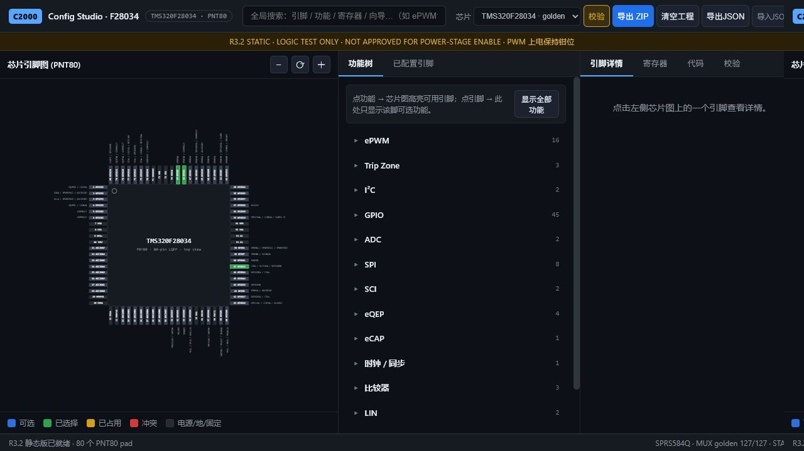

# WTOOL-C2000-CONFIG-R3.2-STATIC 交付记录

## 状态

- 发布状态：`CONFIG_STUDIO_R3.2_STATIC_IN_PROGRESS`
- 内部闸门：`INTERNAL_PASS`
- 用户线上验收：待完成
- 生产目录：`dist/`

内部闸门通过不代表功率级批准，也不把发布状态提前改成最终状态。

## 静态运行边界

`dist/` 只包含 HTML、CSS、JavaScript、JSON、Markdown 和 `.nojekyll`。
生产页面的校验、生成和 ZIP 都在浏览器执行；Python 参考实现、容器文件和
服务器脚本不会进入发布目录。

所有资源引用均为相对路径，并在 `/test-repo/` 子路径完成验收。

## MUX golden

- 有效非 Reserved 选项：127
- mismatch：0
- extra：0
- missing：0
- 17 个指定选项：MUX3
- GPIO35/TDI、GPIO36/TMS、GPIO37/TDO、GPIO38/TCK：不作为普通候选
- 每个 GPIO 的 MUX0..3 槽位完整保留，空槽标记为 Reserved

## ProjectConfig 与生成器

- 唯一 schema：`schema_version: 1`
- 草稿流程：begin → update → buildCommitPlan → validate → applyAtomically
- 事务失败时：当前内存对象与 localStorage 均保持不变
- 已覆盖互补转单路、Trip 禁用、Trip 源切换、无空闲互补脚和无空闲 Trip 脚
- 预览与 ZIP 使用同一 `generateProject()` 结果
- ZIP 使用固定时间戳、文件名排序和 store 模式，输出可重复
- 预览内容与 ZIP 解包内容逐字节相同

## 内部验收结果

| 验收层 | 结果 |
|---|---:|
| Python 历史/证据回归 | 55 项通过，1 项因无未核验 MUX 可测而跳过 |
| 浏览器核心 Node 测试 | 11/11 |
| dist 结构与运行时扫描 | 通过 |
| Playwright 静态用户流程 | 5/5 |
| 应用内浏览器人工复核 | 通过，控制台错误 0 |

Playwright 覆盖：

1. `/test-repo/` 子路径启动，PNT80 80 脚渲染。
2. Pin69 → EPWM1A → A/B 互补 → TZ1 原子提交。
3. 生成代码安全标头与 `EPWM1_ReleaseClamp()`。
4. 预览与下载 ZIP 解包内容完全相同。
5. 刷新后 ProjectConfig 持久化。
6. Pin3 → SCLA，只有 pinmux，不生成 ADC 文件。
7. ProjectConfig JSON 导出、清空、导入恢复。
8. 浏览器加载的 17 个 MUX3 修正与 JTAG 删除。
9. Trip 资源冲突时内存与 localStorage 均不改变。

应用内浏览器截图：

## 尚未关闭的发布闸门

1. 推送到 GitHub。
2. GitHub Actions 从 `dist/` 部署 Pages。
3. 在线 URL 重新执行真实浏览器与网络请求检查。
4. 用户在实际网页完成验收。
